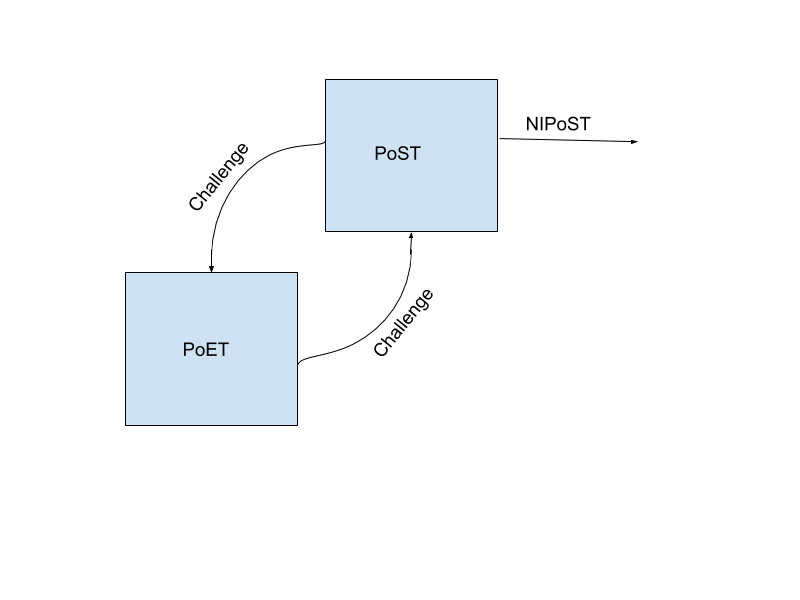

## Mining - Non-interactive Proof of Space-time

Non-interactive Proof of Space-time (NIPoST) is an algorithm that can be used to construct a self-contained [Proof of Space-time (PoST)](02-post.md) that is fully deterministic, non-interactive, and publicly-verifiable. In essence, it involves chaining together a series of Proofs of Space-time (PoST) and Proofs of Elapsed Time (PoET) in such a fashion that a verifier can independently verify that the prover had access to a certain dataset for an arbitrarily long period of time (subject to the rationality argument presented in [PoST](02-post.md), i.e., that in theory the prover could’ve chosen instead to regenerate the dataset every time a proof was generated, but that to do so would be expensive and would not afford any advantage). In this respect NIPoST may be thought of as the _glue_ that chains multiple, sequential proofs together, or alternatively as a _second order_ or _meta-proof_ which wraps or contains, as constituent parts, a Proof of Elapsed Time and multiple Proofs of Space-time.

In the context of Spacemesh, NIPoST proofs are generated and submitted by miners to the network as part of an [ATX](05-atx.md) to assert their eligibility to mine in the following epoch.

## Construction

Although the proving protocol in [PoST](02-post.md) can be made non-interactive using the [Fiat-Shamir heuristic](https://en.wikipedia.org/wiki/Fiat%E2%80%93Shamir_heuristic) (replacing the verifier’s response to the commitment, the challenge, with a hash of the commitment), the execution phase still requires interaction: the proof must be generated as a response to an unpredictable challenge. In addition, the _time_ component of the space-time resource is not publicly-verifiable, and depends on the verifier’s measurement of the elapsed time between phases.

However, by creating a dependency between PoST and PoET, we can create a single, self-contained proof that is entirely non-interactive and publicly-verifiable. The key insight is to use the output of the initialization phase (or the previous execution phase if we’re running multiple times, as in the Spacemesh protocol) as the challenge to PoET, and then use the output of PoET as the challenge to the execution phase. (Note that we may choose to hash these challenges first to reduce them to a fixed size, which has no negative implications on security.) This construction creates a non-interactive proof-of-space-time (NIPoST) that convinces a verifier that the prover committed sufficient space-time resources (i.e., a proven amount of space for at least a proven length of time).

The prover cannot guess the PoST commitment value without first generating the PoST data, and cannot guess the PoET outcome before waiting the specified duration after learning the PoST commitment. This creates a coupling between PoST and PoET which enables a non-interactive proving process, i.e., one in which the verifier does not take part.

## Chaining

The NIPoST is intended to be chained: the initial NIPoST starts with the initialization phase, which generates data with respect to a specific ID, and ends with an execution phase to prove that the data are still stored (see [more on these phases](02-post.md#phases)). Each subsequent NIPoST starts with the output of the previous NIPoST execution phase as its input. As described in [PoST](02-post.md#proving), this is not unlike the way in which each Bitcoin block refers to the previous block, with a genesis block upfront (analogous to the initial, commitment phase proof, in our case).

A single PoST output isn’t intended to be directly and exclusively used as the PoET statement (i.e., the piece of data that PoET asserts knowledge of for some period of time). As explained in the [PoET section](03-poet.md), individual miners aren’t expected to perform the Proof of Sequential Work (PoSW) required to produce a PoET themselves, which would be extremely computationally expensive. Instead, they submit their challenges to a public PoET service, which aggregates them into a Merkle tree to produce one shared PoET statement.

## Proof

Unlike PoST and PoET, construction of NIPoST does not require commitment of any additional resources or any additional, complex computation. Instead, it just requires input in the form of the PoST and PoET proofs themselves (which, in turn, attest to the committed resources). The full NIPoST consists of the following components, each of which is verified independently:

1. The PoST initialization phase proof, or, in the execution phase, the previous execution phase proof
2. A Merkle path that proves the inclusion of a challenge based on this proof in the aggregate graph that serves as the PoET statement. The challenge is the PoST initialization phase commitment (or a hash of the previous execution phase proof, in the execution phase).
3. A PoET whose input is the root of this Merkle tree
4. The PoST of the following execution phase whose challenge is a hash of the output of this round’s PoET output

While each PoST contains the publicly-verifiable _space_ component, the PoET is used to prove in a publicly-verifiable way the duration between adjacent PoST proofs, i.e., the _time_ component. The combination of these two components proves commitment of the _space-time resource_, i.e., a proven amount of space committed for (at least) a proven amount of time.

The duration component of a NIPoST cannot be directly measured in clock time (which cannot be proven in a publicly-verifiable way). Instead, the NIPoST uses [_sequential work_](03-poet.md) as a proxy for time. That is, the duration is measured as a number of sequential CPU operations, e.g., hash invocations.

## Publishing

In Spacemesh, in order to publish a NIPoST to the network and assert a miner’s eligibility to produce blocks in the following epoch, the NIPoST is embedded in a special type of transaction called an _Activation Transaction_ (known as an ATX). This leads to a slightly different mechanism than the one described above, where in fact it is not the NIPoSTs which are being chained, but rather the ATXs. To allow that, the challenge to PoET contains, in addition to what was described above, some additional fields from the ATX which embeds the NIPoST. Read on to the [next section](05-atx.md) to learn more.

